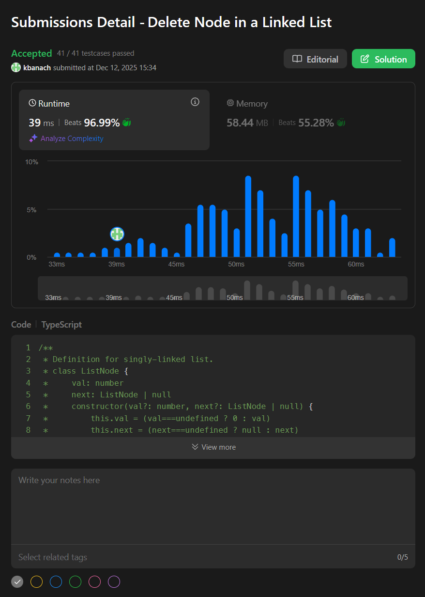
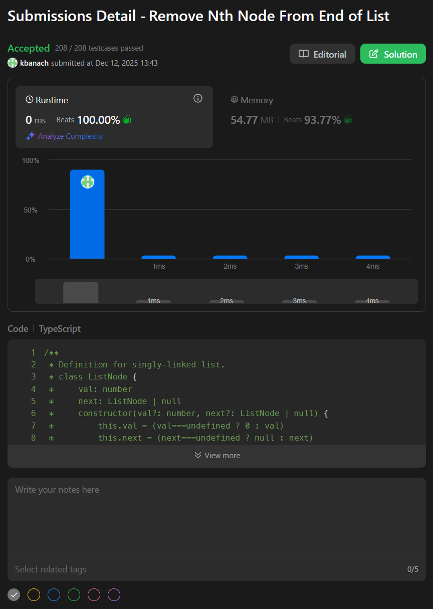
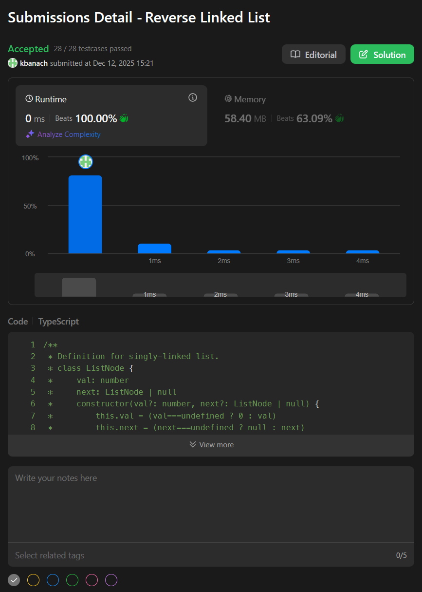
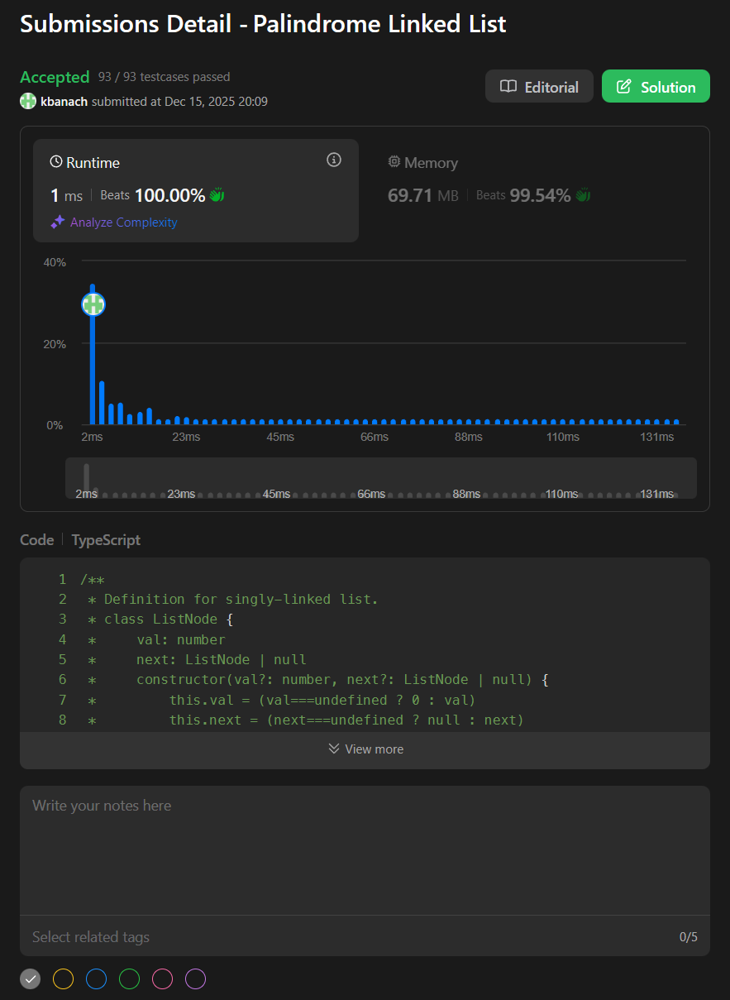

# Solutions

[2025-12-11 Delete Node in a Linked List](../linked-lists/2025-12-11_linkedLists_deleteInLinkedList.ts)

---

[2025-12-12 Remove Nth Node From End of List](../linked-lists/2025-12-12_linkedLists_removeNthNodeFromEnd.ts)

---

[2025-12-12 Reverse Linked List](../linked-lists/2025-12-12_linkedLists_reverseLinkedList.ts)

---

[2025-12-13 Merge Two Sorted Lists](../linked-lists/2025-12-13_linkedLists_mergeSortedLists.ts)

---

[2025-12-15 Palindrome Linked List](../linked-lists/2025-12-15_linkedLists_palindromeLinkedList.ts)

